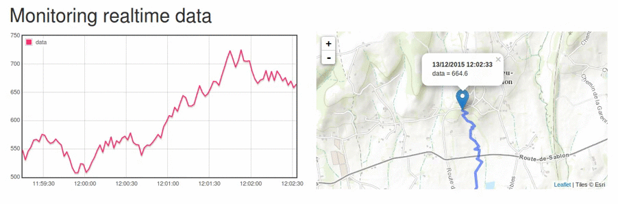

# Realtime data plot with map
Small web interface to show realtime data with a map.

It use the Python microframework [Flask] with :
 * [Bootstrap] for the two-column design,
 * [Leaflet] for the map,
 * [JQuery] and the [flot] plugin for the chart.

This example is made from an idea of [PythonWise] blog.  

For example, it can be use to follow a moving [Raspberry Pi] with a sensor data and a GPS. This Raspberry Pi must send data into a distant database.

I made `fake_data.py` to simulate a moving Raspberry Pi. `monitor.py` is a [Flask] application to show data on chart and map.

It works with Python 3.5.

## How to use it ?

Clone this repository :

    git clone https://github.com/jnth/realtime-data-with-map.git
    cd realtime-data-with-map

In a terminal :

    python fake_data.py /tmp/data.db

You will see random data like this :

    sqlite3: create table ok
    2015-12-13 11:36:16     3.961,   4.999422,  45.000980
    2015-12-13 11:36:18    -6.000,   4.999101,  45.001092
    2015-12-13 11:36:20   -13.732,   4.998480,  45.001525
    ...

Do not close the terminal and in an other terminal :

    python3.5 monitor.py /tmp/data.db

See the realtime data and map at [http://localhost:5000](http://localhost:5000).

[Flask]: http://flask.pocoo.org/
[Bootstrap]: http://getbootstrap.com/
[Leaflet]: http://leafletjs.com/
[JQuery]: https://jquery.com/
[flot]: http://www.flotcharts.org/
[PythonWise]: http://pythonwise.blogspot.fr/2014/11/a-streaming-chart-using-flask-and-flot.html
[Raspberry Pi]: https://www.raspberrypi.org
